# Food habits

This project is part of the [EPFL](http://epfl.ch)'s [Applied Data Analysis course](http://ada.epfl.ch) and promotes Data Science in Switzerland. The concept is not spatialy restricted and can be easily generalized elsewhere.

## Abstract

Switzerland is well know for its rich heritage: incredible landscapes, watches, cheese, chocolate and diversified influences from its five neighboring countries. This project investigates how this heritage is reflected in terms of food habits.
Thanks to the high restaurant density, we picked 2 Swiss and 3 French cities to get insights about dietetics. We mapped restaurant meals to recipes and ingredients of recipes to products to analyze corresponding nutriments. 

_**Is any area-based nutrition bias ?**_

Our infrastructure and datasets also allow us to explore other topics such as:

- food trends according to clichés (e.g. Rösti, Malakoff)
- food/nutriments variety per locations (e.g. meals with more salt/lipids/etc..) 

## Data description

- 11k restaurants (e.g. [LaFourchette](https://www.lafourchette.com))
- 35k meals (extracted from the restaurants' menus)
- 170k recipes (various websites, e.g. [CuisineAZ](http://cuisineaz.com))
- 1.3M ingredients (derived from the recipes)
- 5k products (e.g. [FDDB](http://fddb.info), [OpenFood](https://www.openfood.ch))
- 40k nutriments (extracted from the products)

## Assumptions

We assumed that:

- the restaurants listed in LaFourchette were representative enough of the local food habits.
- we could associate recipes to meals and products to recipes well enough to derive the nutritious facts for a meal.

## Data pipeline 

We implemented the following data pipeline :

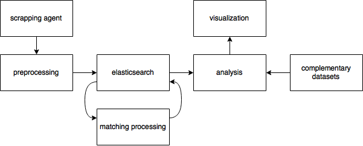

## Matching

We used this process to find matches:

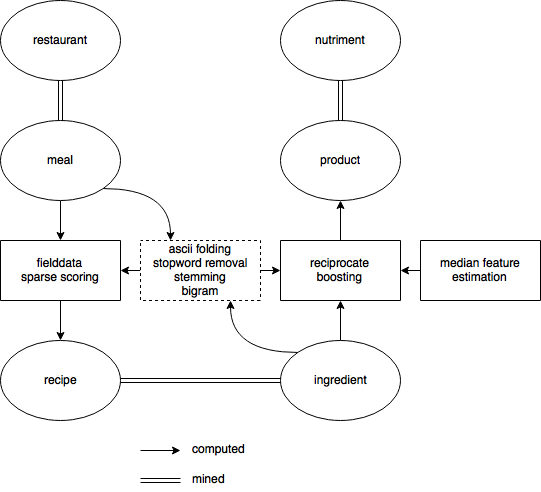

#### Types of matching

| Disadvantage | Advantage |
|:---:|:---:|
| **Rare events, misspelled, grouped** Pavé de boeuf aux morilles _Pavé de boeuf aux morilles_ simplissimes   |   **Order tolerance** Tiramisu caramel speculos beurre salé _Tiramisu au caramel_ au _beurre salé_  et _spéculoos_    |
| **Wide, personal meaning** café gourmand _café gourmand_ à ma façon     | **Exact match** Salade d'orange au miel et à la cannelle _Salade d'orange au miel et à la cannelle_   |
| **Principal component** Rognons de lapins à la moutarde de Meaux Fricassée de champignons _à la moutarde de Meaux_    | **Limited difference** Terrine de foie gras et confiture de pruneaux _Terrine de foie gras_ aux _pruneaux_ et raisins secs    |
| **Unknown, language** Tartare de boeuf minute, salade et potatoes Twice baked _potatoes_ au bacon | **Complex** Cassolette de Saint-Jacques et crevettes Ravioles, noix _de Saint-Jacques_ et _crevettes_ en _cassolettes_ raffinées    |

## Food trends

A few examples of food facts we can extract from the datasets with our infrastructure.

|                                                                                       |                                                                               |
|:-------------------------------------------------------------------------------------:|:-----------------------------------------------------------------------------:|
| 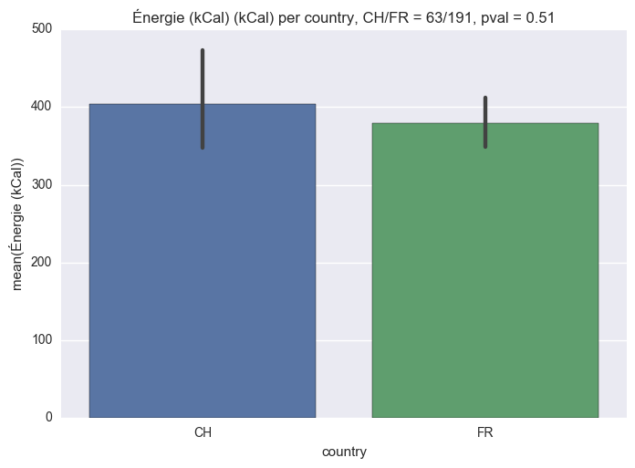 Energy(kCal) per country  | 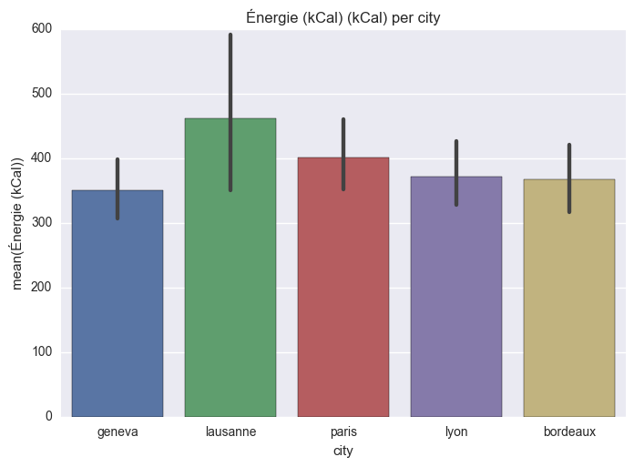 Energy(kCal) per city   |
| 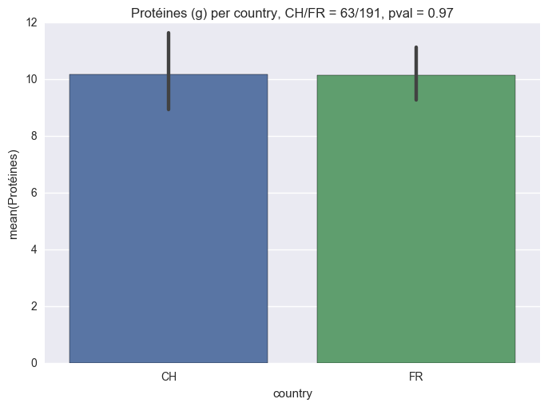 Protein per country     | 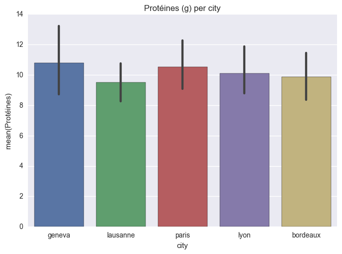 Protein per city      |
| 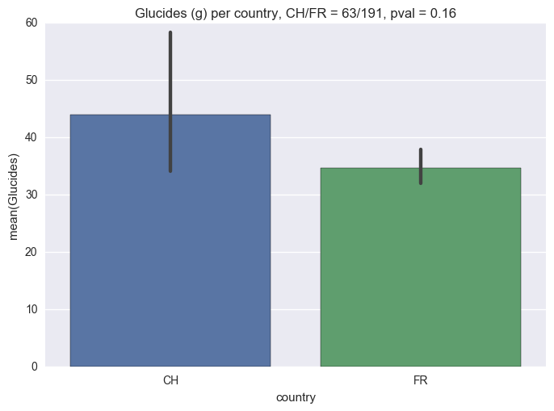 Carbohydrates per country   | 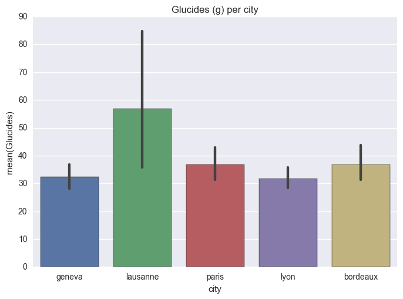 Carbohydrates per city    |
| 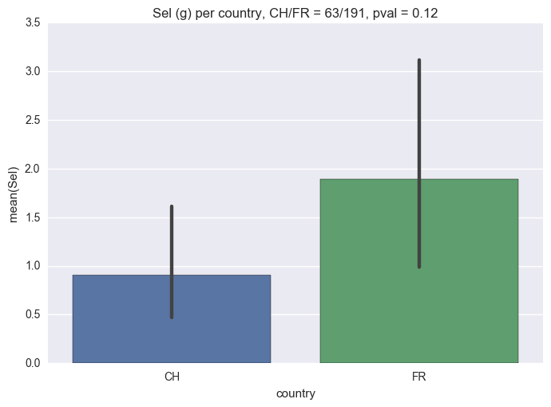 Salt per country              | 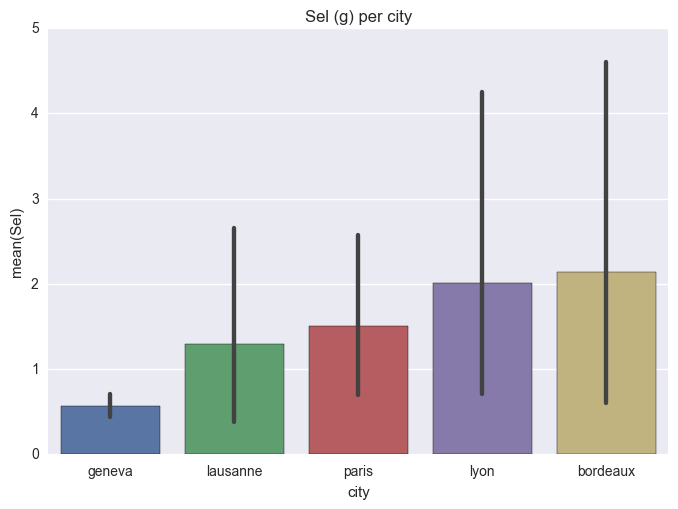 Salt per city               |

## Visualization

Here are a few visualization examples for cliché-meal searches:

|                                                   |                                                   |
|:-------------------------------------------------:|:-------------------------------------------------:|
| 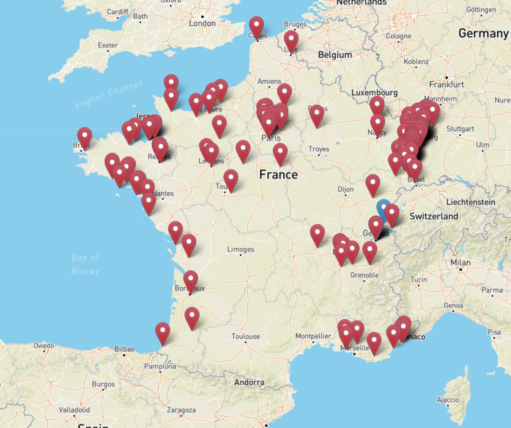   | 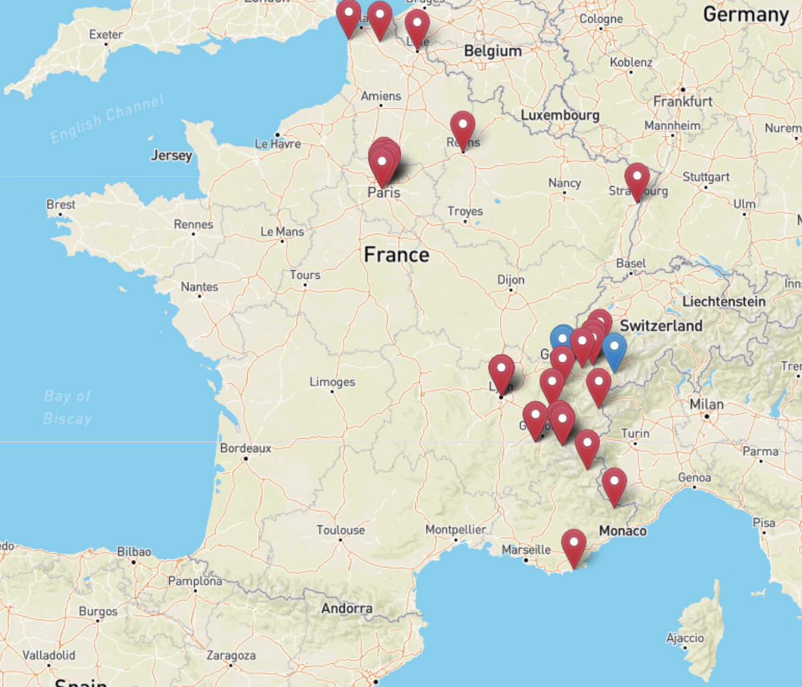  |
| [Choucroute](https://en.wikipedia.org/wiki/Choucroute_garnie) (red), [Malakoff](https://en.wikipedia.org/wiki/Malakoff_(food)) (blue) | [Fondue Savoyarde](https://en.wikipedia.org/wiki/Fondue) (red), [Fondue au fromage](https://en.wikipedia.org/wiki/Fondue#French_alpine) (blue) |

## Results

Expected food trends were present as one could expect from well-known clichés. Looking closer at the estimated nutritious facts, the high variance and noisiness of the datasets coupled to matching process increases the difficutly of the analysis.
No relevant area-based nutrition bias among the insights was found. One could nonetheless use the matching process and the pipeline as tools for further investigation.

## Expected and encountered challenges

Before starting the project, we expected the following points to be the most challenging:

- datasets collection : menus data can be difficult to gather
- sparsity and spatial homogeneity : depending on datasets quality some regions might need to be ignored due to lack of data
- content languages : textual informations (including menus) can have different name depending on area, standardization and translation might be needed
- data completeness : non food data might need be extracted from different sources to achieve a valuable meaning

After finishing the projects, the challenges actually were the following ones:

- Data mining and normalization (high variance, different sources, captchas)
- Data organization (complex queries, centralized storage with ElasticSearch)
- French NLP (weird characters, hard modeling)
- Matching (many candidates, heterogeneous units)
- Computationally heavy (vectorization, visualization)

Regarding the content languages, no data was available for the German and Italian part of Switzerland on LaFourchette. Therefore we focused our work on France and the French part of Switzerland.

## Improvements

- Formal statistical evaluation
- Deep recurrent model for matching
- Computational efficiency
- Expand visualization
- More and enhanced data for Switzerland

## License

Project is available under [Apache 2.0](./LICENSE) license and data belong their owners under appropriate licensing.
